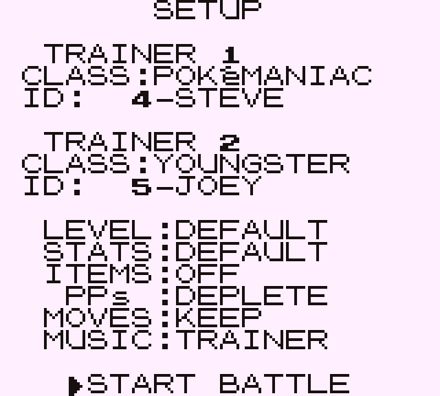
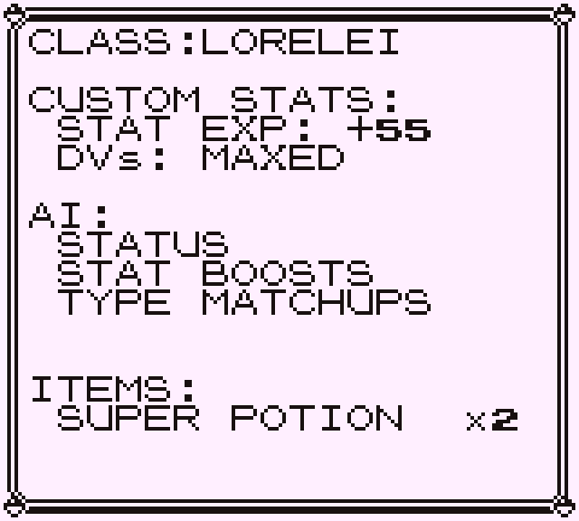
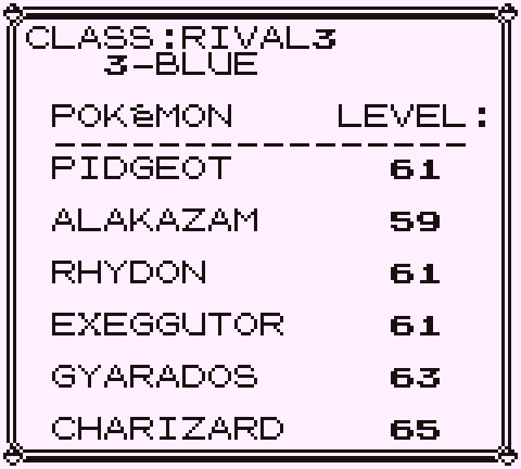
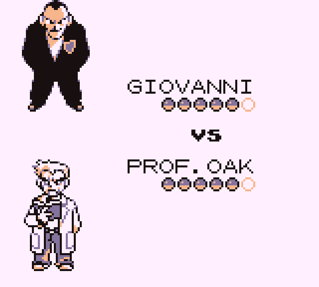
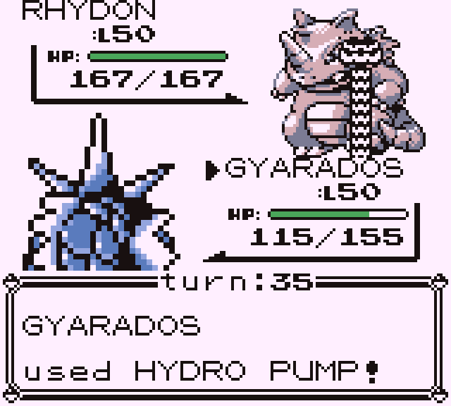

# Pokémon Red AI Tournament

This is a fork of the Pokemon Red and Blue disassembly (https://github.com/pret/pokered), in which I implemented a way to run AI vs AI battles between any trainers defined in the ROM.

To set up the repository, see [**INSTALL.md**](INSTALL.md).

The changes I made break normal trainer battles as well as wild battles, so ROMs made from this code cannot be used to play the game normally, only to use the battle simulator.

To start a battle, just press A in front of the SNES in Red's room, and use the setup menu to configure the battle and start it.

&nbsp;

## Configuration options available are:

* **level scaling**: you may set the level of all Pokemon on both sides. Default is to leave levels unchanged from the ROM's party data.
* **custom stats**: you may use custom Stat Exp and DVs. Each trainer class belongs to a Stat Exp tier and a DVs tier. You can see those by pressing A on the Trainer Class. Default is to use standard Stat Exp and DVs like in vanilla Red (0 Stat Exp and average DVs). Using custom stats will increase loading times for Trainers with high Stat Exp values.
* **items**: you may let the AI use its items, if any, or you may disable items completely.
* **PPs**: you may have PPs deplete, or let them be infinite.
* **move scaling**: when using level scaling, you may let movesets be modified according to the level (Scale) or keep movesets unchanged from the ROM's party data (Keep). Special moves for Gym Leaders, Elite 4 and the Rival are retained when scaling moves (because they are part of the party data now, see below).
* **music**: you may set the battle music to any of the 4 available tracks (Trainer, Gym Leader, Champion, or Wild).

&nbsp;

Pressing A on a Trainer Class will display that class's custom stats tiers, as well as its AI and items.

Pressing A on a Trainer will display its team (only Pokemon and levels).

Pressing A on the level option will increase the level by 5. Use this to speed up the process of setting a level. Note that this item wraps back to 100 when pressing left while on Default, so you can also use this to reach high levels quickly.

&nbsp;

There are 2 empty trainer classes in the ROM, when you get to those in the setup menu, the trainer ID will display [NO DATA]. You can't start a battle if one of the trainers is in this state (you will get a nice error message).

&nbsp;

## Changes from vanilla Red in AI vs AI battles:

* Removed the 25% chance of stats-reducing effects failing when used by the enemy
* Removed the badge boosts for the player (even though you can't really get badges with this ROM anyway)
* Removed battle menu for the player, duplicated Trainer AI for the player's side and used that instead
* Removed blacking out, and player's party is healed after battle
* Removed the ability to select a move to copy with Mimic for the player
* Removed the difference in Psywave's damage formula between the player's side and the enemy's side (now both do at least 1 damage)
* Implemented PP depletion for the enemy
* Added individual trainer names to more easily distinguish each trainer in a class
* Added current HP/max HP under the enemy's HP bar
* Added actor indicator in the HUD to give a clear way of knowing who is acting when both Pokemon are the same species
* Added turn counter (2 bytes, so can count up to 65536 turns, which should be plenty enough in most cases)
* Added start and end of battle screens
* Made texts identical between player and enemy for sending out/retreating Pokemon, as well as in various other places

With these, the battles are now perfectly symetric between both sides.
All the "quirks" and bugs not mentionned above were left in.

&nbsp;

## Other changes

I also changed the trainer data format to allow them to be more easily editable. The new format is:
* pokemon species, pokemon level, move 1, move 2, move 3, move 4 (repeated 6 times)

Pokemon species = 0 means empty slot, if first pokemon slot of first trainer in a class is empty, it means the trainer class is empty

move = $ff means default move for this slot (according to level and learnset)

move = 0 means empty slot (I adapted the AI so that it skips empty slots and looks past them instead of stopping)

Any value other than $ff for a move slot overrides the move the pokemon would normally have (with or without move scaling).

Special moves (for Gym Leaders etc.) are no longer given after initialization of the moveset, but are now specified directly in the party data of the appropriate trainers.

&nbsp;

You can add trainers or even trainer classes if you wish, or you can just customize existing trainers to your liking.

The trainer classes' custom stats are found in data/trainer_classes_tiers.asm.

The actual values for the tiers are in constants/trainer_constants.asm.

&nbsp;

## Screenshots

|Setup menu|Trainer Class info screen|Trainer Team info screen|Start of battle screen|Battle screen|
|---|---|---|---|---|
||||||
